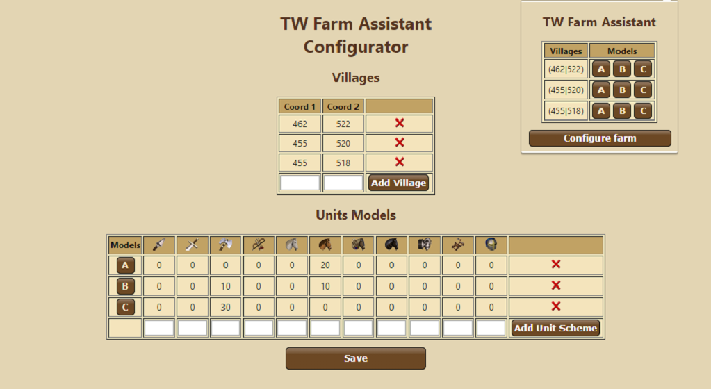
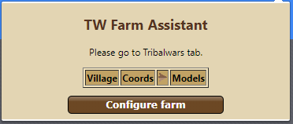
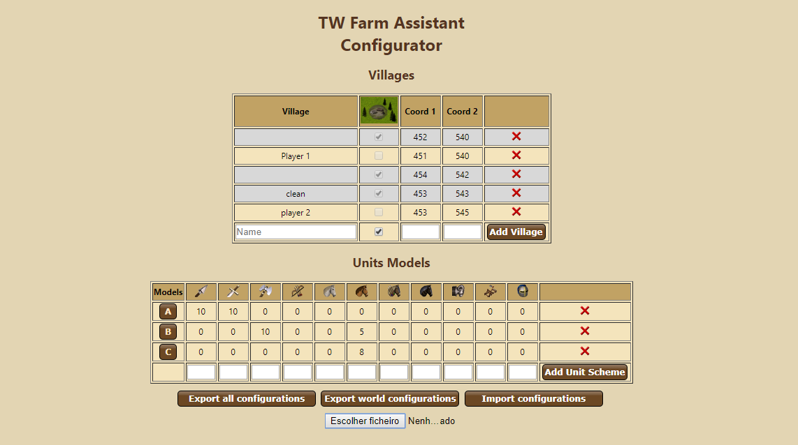
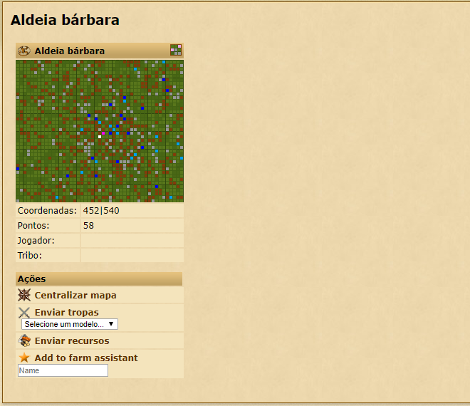
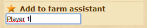
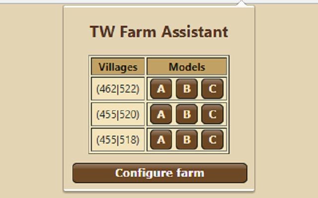

# TW Farm Assistant

Tribalwars Farm Assistant is an extension that provides a free, easy-to-use and configurable alternative to the in-game Farm Assistant.

## Instructions

### How to install it?
The easiest way to install it is from the [Chrome Web Store](https://chrome.google.com/webstore/detail/tw-farm-assistant/pdfmicofbncclmklndnedcgedogelgoa).

As TW Farm Assistant is a personal open-source project you are free to modify it/make your contributions and run it from the Google Chrome's Extension Page by enabling the developer mode.

### How to use it?

#### Step 1 (Get to know the tool)

When you first install the extension you won't have any villages or units models configured and by clicking you may see this:

To add a new village and/or units model click in "Configure farm" button.

#### Step 2 (Add villages and units models)

This configuration page is very intuitive and similar to the tribalwars style. In the first table you can add or remove villages, give  it a name to identify it and select whether it is abandoned or not. In the second one you can add or remove units models.

#### OR

You can also store the village from its overview page.

In this bottom button you can input a name to identify the village (by default it is filled with the name of the owning player or empty for abandoned villages). This will automatically store it.

#### Step 3 (Farm)

Now that you have all setup and running your extension popup may look similar to this.

To start farming **MAKE SURE THAT YOU HAVE ONLY ONE TAB OF THE GAME OPEN** and click the model you want to use. Now you may see your attack been placed in the next seconds *et voilá!* 

#### Step 4 (Share your configuration)

In the bottom of the configuration page there are three buttons.

- 'Export all configurations' is used to download a file containing the configurations of all worlds.
- 'Export world configurations' is used to download a file containing the configurations of the current world.
- 'Import configurations' is used to import the configuration through the selected file, **PLEASE NOTE, if it is afile from 'Export world configurations' button it will only override the specific world, but if it is a file from 'Export all configurations' button it will OVERRIDE ALL YOUR CURRENT CONFIGURATIONS**

You can use this feature not only to share this configurations files between the computers you play the game on but also to share them with your friends!

---

## FAQ's

### Will I get banned for using this extension?
You may use this extension by your own risk but nobody has been banned for using it. The tool is simply a "click automation" and 0% intrusive.

### Does this extension works in all worlds and all countries?
Yes, the tool was designed and built to run in every world of every country.

### How many units models/templates can I store?
Unlike the in-game assistant that only allows you to store 2 models, this extension allows you to store unlimited number of models.

### Does this tool replace the in-game farm assistant?
No, some of the aspects different from the in-game assistant that you need to be aware are:
- Villages coordinates need to be added manually.
- Because the coordinates are manually inserted you **must keep an eye** on the reports you get to make sure that the village stills abandoned and that you are not losing unnecessary troops.
- There isn't any visual sign when the attack command is placed (besides the page reload) so you have to make sure you only click once or you you will end up placing multiple attacks to the same village.
- The extension doesn't take into consideration if you have sufficient units to place the attack, although if you don't the attack won't be placed.

---

As a lover of Tribalwars I developed and shared this tool with the only intent of providing a free farm alternative to all the game lovers.

:exclamation: If you have any question, problem or improvement idea leave it in a issue :exclamation:

---

## Release History

### 0.2 (What's new?)
- Villages with name and abandoned checkbox
- Automatic village storage through button in village information page
- Visual indication of abandoned villages
- Useless save button removed from options page
- Export and import configurations

### 0.1
- Automatic attack
- Villages and unit models manual configuration
